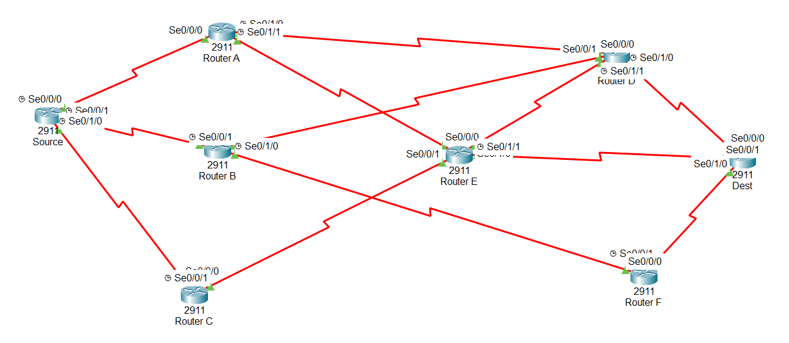

# Routage Sécurisé de Données Sensibles — Plus Court Chemin avec Dijkstra/OSPF

## Contexte
Projet réalisé individuellement dans le cadre du module de Recherche
Opérationnelle, appliquant l'algorithme de Dijkstra au routage optimal
de données sensibles dans un réseau maillé, via une métrique composite
intégrant latence réseau et risque de sécurité.

## Problématique
Formule du coût composite utilisée pour pondérer chaque liaison :

    Coût(u,v) = Latence(u,v) + 10 × Risque(u,v)

Cette pondération pénalise fortement le risque de sécurité par rapport
à la latence : un risque élevé coûte 10x plus cher qu'une milliseconde
de latence supplémentaire — pertinent pour l'acheminement de données
classifiées, où la sécurité prime sur la rapidité.

## Objectifs
- Modéliser un réseau maillé de 8 routeurs interconnectés (Cisco 2911)
- Implémenter OSPF avec des métriques de coût personnalisées
- Identifier le plus court chemin sécurisé entre Source et Destination
- Valider la connectivité end-to-end
- Tester la résilience du réseau face à des pannes de liens multiples

## Architecture et topologie

Réseau de 8 routeurs (Source, A, B, C, D, E, F, Destination) reliés par
des liaisons série, chacune pondérée par un coût composite latence/risque.

## Outils utilisés
- Cisco Packet Tracer 8.2
- Routeurs Cisco 2911 (modules HWIC-2T, interfaces Serial)
- Protocole OSPF (Open Shortest Path First)

## Méthodologie

### 1. Plan d'adressage IP
Adressage en /30 pour chaque liaison point-à-point, avec interfaces
loopback dédiées à l'identification stable des Router-ID OSPF.

### 2. Configuration OSPF et métriques
Chaque liaison se voit attribuer un coût OSPF calculé à partir de sa
latence mesurée et de son niveau de risque estimé (échelle 1-10),
selon la formule composite définie ci-dessus.

### 3. Tests en conditions normales
- Vérification des interfaces (toutes UP/UP)
- Établissement des voisinages OSPF (adjacences FULL)
- Validation des coûts OSPF appliqués
- Test de connectivité : 100% de réussite, latence moyenne 13 ms
- **Chemin optimal identifié : Source → A → D → Destination** (coût 120)

### 4. Tests de résilience (scénarios de pannes)
**Scénario 1 — Panne du lien A→D (chemin optimal) :**
Le réseau bascule automatiquement vers `Source → B → D → Destination`,
un chemin alternatif offrant même une meilleure sécurité, au prix d'un
coût légèrement supérieur.

**Scénario 2 — Double panne (A→D + B→D + B→F) :**
Même dans ce scénario de panne cumulée, le réseau reste fonctionnel via
`Source → C → E → Destination`. Ce chemin de secours présente cependant
un risque de sécurité élevé, mettant en évidence l'importance de
restaurer rapidement les liens critiques.

## Résultats clés

| Chemin | Coût sécurisé | Latence pure | Risque combiné |
|---|---|---|---|
| **Optimal** (S→A→D→Dest) | 120 | 60 ms | 6 |
| Via B-D (après panne) | 150 | 110 ms | 4 |
| Via C-E (double panne) | 230 | 40 ms | 19 |

## Contenu du repository
- 📄 [Rapport complet (PDF)](report/Rapport-mini-projet-RO.pdf)
- 🖧 [Simulation Cisco Packet Tracer (.pkt)](simulation/simulation projet R.O.pkt)

## Conclusion
Ce projet démontre qu'OSPF, combiné à une métrique composite personnalisée,
permet de déterminer efficacement un chemin réseau équilibrant sécurité et
performance, tout en conservant une résilience face aux pannes. Il illustre
l'application concrète de concepts de Recherche Opérationnelle (théorie des
graphes, algorithme de plus court chemin) à un problème réseau réel.

## Compétences démontrées
`Routage OSPF` `Algorithme de Dijkstra` `Modélisation de risque réseau`
`Cisco Packet Tracer` `Recherche Opérationnelle` `Sécurité réseau` `Résilience réseau`
